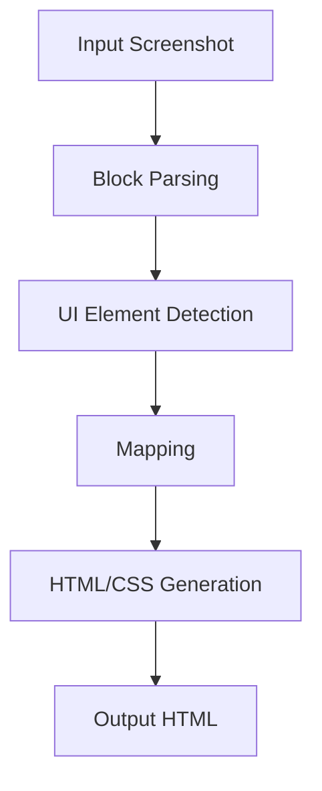

# Image-Coder

## Author
**Hit Kalariya**  
[GitHub](https://github.com/hitkalariya) | [LinkedIn](https://www.linkedin.com/in/hitkalariya/)

---

## About
Image-Coder is an advanced modular framework that generates high-quality HTML code from website screenshots. Leveraging state-of-the-art UI element detection, mapping, and code generation, it enables seamless conversion of visual layouts into production-ready code.

---


## Project Highlights
- **Automated UI to Code**: Converts screenshots to HTML layouts using deep learning and computer vision.
- **Modular Pipeline**: Each stage (block parsing, detection, mapping, replacement) is a separate, reusable module.
- **Advanced UI Detection**: Integrates UIED for robust UI element detection.
- **Customizable Output**: Easily adapt the generated code for different frameworks or design systems.
- **Professional Code Quality**: Clean, maintainable, and extensible Python codebase.

## Project Structure
- `main.py`: Main entry point for generating HTML from a screenshot.
- `block_parsor.py`: Detects layout blocks in the input image.
- `html_generator.py`: Generates HTML with placeholder blocks.
- `image_box_detection.py`: Detects and crops image regions.
- `image_replacer.py`: Replaces placeholders with cropped images.
- `mapping.py`: Maps detected UIED components to logical regions.
- `UIED/`: UI Element Detection engine (deep learning + CV).
- `requirements.txt`: Python dependencies.
- `data/`: Input images and output HTML/code samples.


---

## Setup & Installation
```bash
git clone https://github.com/hitkalariya/image-coder.git
cd image-coder
python -m venv .venv
.venv\Scripts\activate  # On Windows
pip install -r requirements.txt
```

## Usage


### Full Pipeline Example
```bash
# 1. Detect layout blocks
python block_parsor.py --input data/input/test1.png

# 2. Generate HTML with placeholders
python html_generator.py --input data/input/test1.png

# 3. Detect and crop image regions
python image_box_detection.py --input data/input/test1.png

# 4. Run UI element detection
python UIED/run_single.py --input data/input/test1.png

# 5. Map detected elements
python mapping.py --input data/input/test1.png

# 6. Replace placeholders with cropped images
python image_replacer.py --input data/input/test1.png

# Or run the full pipeline
python main.py --input data/input/test1.png
```

---


## Input/Output Visualization

**Input:**


**Output (HTML code):**
<details>
  <summary>View Generated HTML</summary>
  <pre>
<!-- Partial HTML Output -->
<!DOCTYPE html>
<html lang="en">
<head>
<meta charset="utf-8"/>
<title>Bounding Boxes Layout</title>
<style>
body, html { margin: 0; padding: 0; width: 100%; height: 100%; }
.container { position: relative; width: 100%; height: 100%; box-sizing: border-box; }
.box { position: absolute; box-sizing: border-box; overflow: hidden; }
.box > .container { display: grid; width: 100%; height: 100%; }
</style>
<!-- ... -->
  </pre>
</details>

---

## Professional Features
- **Clean API** for integration into other projects
- **Extensive Documentation** and code comments
- **Sample Data** for quick experimentation (`data/input/`, `data/output/`)
- **Modular Design** for easy extension

---

## Motivation
Modern web development often requires converting visual designs or screenshots into code. Image-Coder automates this process, saving time and reducing manual errors, while ensuring pixel-perfect layouts and semantic HTML.

---

## How It Works
1. **Block Parsing:** Segments the input image into logical blocks.
2. **UI Element Detection:** Identifies UI components (buttons, text, images) using deep learning and computer vision.
3. **Mapping:** Aligns detected elements to semantic HTML regions.
4. **Code Generation:** Produces clean, modular HTML/CSS code.
5. **Image Cropping:** Extracts and inserts cropped images where needed.

<details>
<summary>Pipeline Diagram</summary>


</details>

---

## Advanced Customization
- **Custom Models:** Swap in your own detection/classification models.
- **Flexible Mapping:** Adjust mapping logic for different UI/UX needs.
- **Theming:** Integrate with CSS frameworks (Tailwind, Bootstrap, etc.).
- **API Integration:** Use as a backend service or CLI tool.

---

## Contributing
Contributions are welcome! To contribute:
1. Fork the repository
2. Create a new branch for your feature or bugfix
3. Submit a pull request with a clear description

For major changes, please open an issue first to discuss your proposal.

---

## FAQ
**Q: What types of images are supported?**
A: PNG, JPG, and most common screenshot formats.

**Q: Can I use my own UI detection model?**
A: Yes, the pipeline is modular and supports custom models.

**Q: Is this suitable for mobile UI?**
A: Yes, both web and mobile UIs are supported.

**Q: How do I get support?**
A: Open an issue on GitHub or contact Hit Kalariya via [LinkedIn](https://www.linkedin.com/in/hitkalariya/).

---
