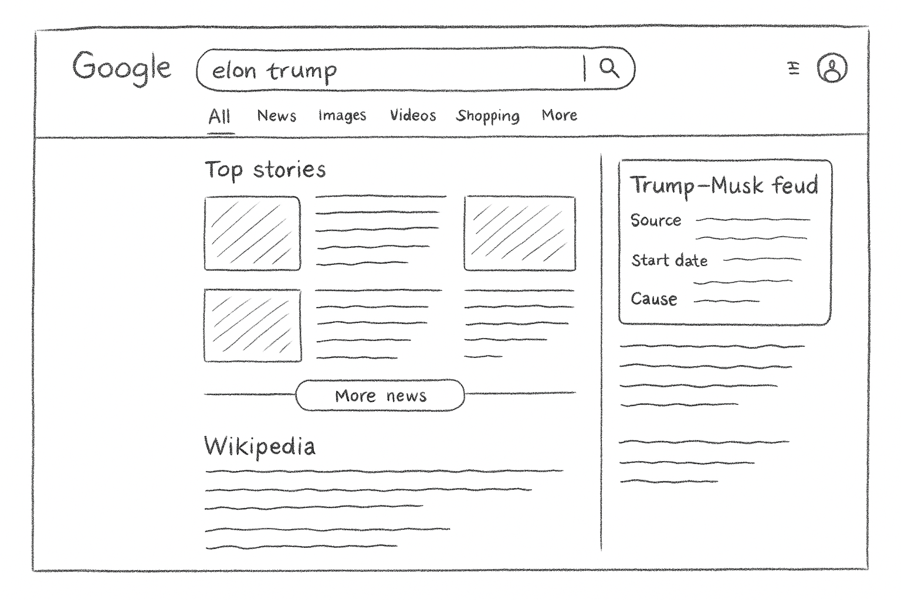

# Image-Coder

## Author
**Hit Kalariya**  
[GitHub](https://github.com/hitkalariya) | [LinkedIn](https://www.linkedin.com/in/hitkalariya/)

---

## About
Image-Coder is an advanced modular framework that generates high-quality HTML code from website screenshots. Leveraging state-of-the-art UI element detection, mapping, and code generation, it enables seamless conversion of visual layouts into production-ready code.

---


## Project Highlights
- **Automated UI to Code**: Converts screenshots to HTML layouts using deep learning and computer vision.
- **Modular Pipeline**: Each stage (block parsing, detection, mapping, replacement) is a separate, reusable module.
- **Advanced UI Detection**: Integrates UIED for robust UI element detection.
- **Customizable Output**: Easily adapt the generated code for different frameworks or design systems.
- **Professional Code Quality**: Clean, maintainable, and extensible Python codebase.

## Project Structure
- `main.py`: Main entry point for generating HTML from a screenshot.
- `block_parsor.py`: Detects layout blocks in the input image.
- `html_generator.py`: Generates HTML with placeholder blocks.
- `image_box_detection.py`: Detects and crops image regions.
- `image_replacer.py`: Replaces placeholders with cropped images.
- `mapping.py`: Maps detected UIED components to logical regions.
- `UIED/`: UI Element Detection engine (deep learning + CV).
- `requirements.txt`: Python dependencies.
- `data/`: Input images and output HTML/code samples.


---

## Setup & Installation
```bash
git clone https://github.com/hitkalariya/image-coder.git
cd image-coder
python -m venv .venv
.venv\Scripts\activate  # On Windows
pip install -r requirements.txt
```

## Usage


### Full Pipeline Example
```bash
# 1. Detect layout blocks
python block_parsor.py --input data/input/test1.png

# 2. Generate HTML with placeholders
python html_generator.py --input data/input/test1.png

# 3. Detect and crop image regions
python image_box_detection.py --input data/input/test1.png

# 4. Run UI element detection
python UIED/run_single.py --input data/input/test1.png

# 5. Map detected elements
python mapping.py --input data/input/test1.png

# 6. Replace placeholders with cropped images
python image_replacer.py --input data/input/test1.png

# Or run the full pipeline
python main.py --input data/input/test1.png
```

---


## Input/Output Visualization


### Draft Example
**Input:**


**Output (HTML code):**
<details>
  <summary>View Generated HTML</summary>
  <pre>
<!DOCTYPE html>
<html lang="en">
<head>
  <meta charset="UTF-8">
  <meta name="viewport" content="width=device-width, initial-scale=1.0">
  <title>Google Search Draft</title>
  <style>
        
    body {
      font-family: Arial, sans-serif;
      margin: 0;
      padding: 20px;
      background-color: #ffffff;
      color: #202124;
    }

    .container {
      max-width: 1100px;
      margin: 0 auto;
    }

        
    .header {
      display: flex;
      align-items: center;
      gap: 20px;
      margin-bottom: 20px;
    }

    .google-logo {
      font-size: 24px;
      font-weight: bold;
      color: #4285F4;
    }
        
    .google-logo span:nth-child(2) { color: #DB4437; }
    .google-logo span:nth-child(3) { color: #F4B400; }
    .google-logo span:nth-child(4) { color: #4285F4; }
    .google-logo span:nth-child(5) { color: #0F9D58; }
    .google-logo span:nth-child(6) { color: #DB4437; }

    .search-container {
      flex-grow: 1;
      display: flex;
      align-items: center;
      border: 1px solid #dfe1e5;
      border-radius: 24px;
      padding: 5px 15px;
      height: 44px;
    }
        
    .search-container:hover {
      box-shadow: 0 1px 6px rgb(32 33 36 / 28%);
    }

    .search-input {
      flex-grow: 1;
      border: none;
      outline: none;
      font-size: 16px;
    }
        
    .search-icon {
      font-size: 20px;
      color: #9aa0a6;
    }

    .user-icon {
      width: 32px;
      height: 32px;
      border-radius: 50%;
      background-color: #8ab4f8;
      text-align: center;
      line-height: 32px;
      color: white;
      font-weight: bold;
    }

        
    .nav-tabs {
      display: flex;
      gap: 20px;
      border-bottom: 1px solid #ebebeb;
      padding-left: 20px;
      margin-bottom: 20px;
    }

    .nav-tabs a {
      text-decoration: none;
      color: #5f6368;
      padding-bottom: 10px;
      font-size: 14px;
    }

    .nav-tabs a.active {
      color: #1a73e8;
      border-bottom: 3px solid #1a73e8;
    }

        
    .main-layout {
      display: flex;
      gap: 40px;
    }

    .main-content {
      flex: 2;
    }

    .sidebar {
      flex: 1;
    }

        
    h2 {
      font-size: 22px;
      font-weight: normal;
      margin-bottom: 15px;
    }

        
    .top-stories-grid {
      display: grid;
      grid-template-columns: 1fr 1fr;
      gap: 20px;
      margin-bottom: 20px;
    }

    .story-card {
      border: 1px solid #ebebeb;
      border-radius: 8px;
      overflow: hidden;
      display: flex;
    }

    .story-image-placeholder {
      width: 100px;
      background-color: #f1f3f4;
      background-image: linear-gradient(45deg, #e0e0e0 25%, transparent 25%, transparent 75%, #e0e0e0 75%, #e0e0e0),
                linear-gradient(-45deg, #e0e0e0 25%, transparent 25%, transparent 75%, #e0e0e0 75%, #e0e0e0);
      background-size: 20px 20px;
    }

    .story-text {
      padding: 15px;
    }
        
        
    .text-line {
      height: 12px;
      background-color: #e0e0e0;
      border-radius: 4px;
      margin-bottom: 10px;
    }
    .text-line.short { width: 60%; }
    .text-line.long { width: 90%; }
        
    .more-news-btn {
      display: block;
      width: 100%;
      padding: 12px;
      font-size: 14px;
      background-color: #f8f9fa;
      border: 1px solid #dadce0;
      border-radius: 20px;
      cursor: pointer;
      text-align: center;
      margin: 30px 0;
    }

    .more-news-btn:hover {
      background-color: #f1f3f4;
    }

        
    .wiki-result h3 {
      font-size: 20px;
      color: #1a0dab;
      font-weight: normal;
    }

        
    .knowledge-panel {
      border: 1px solid #dadce0;
      border-radius: 8px;
      padding: 20px;
    }

    .knowledge-panel h3 {
      font-size: 20px;
      margin-top: 0;
    }

    .info-item {
      margin-bottom: 15px;
    }

    .info-item .label {
      font-weight: bold;
      font-size: 14px;
      margin-bottom: 5px;
    }

  </style>
</head>
<body>

  <div class="container">
    <header class="header">
      <div class="google-logo">
        <span>G</span><span>o</span><span>o</span><span>g</span><span>l</span><span>e</span>
      </div>
      <div class="search-container">
        <input type="text" class="search-input" value="elon trump">
        <span class="search-icon">🔍</span>
      </div>
      <div class="user-icon">A</div>
    </header>

    <nav class="nav-tabs">
      <a href="#" class="active">All</a>
      <a href="#">News</a>
      <a href="#">Images</a>
      <a href="#">Videos</a>
      <a href="#">Shopping</a>
      <a href="#">More</a>
    </nav>

    <div class="main-layout">
      <main class="main-content">
        <section class="top-stories">
          <h2>Top stories</h2>
          <div class="top-stories-grid">
            <article class="story-card">
              <div class="story-image-placeholder"></div>
              <div class="story-text">
                <div class="text-line long"></div>
                <div class="text-line long"></div>
                <div class="text-line short"></div>
              </div>
            </article>
            <article class="story-card">
              <div class="story-image-placeholder"></div>
              <div class="story-text">
                <div class="text-line long"></div>
                <div class="text-line long"></div>
                <div class="text-line short"></div>
              </div>
            </article>
            <article class="story-card">
              <div class="story-image-placeholder"></div>
              <div class="story-text">
                <div class="text-line long"></div>
                <div class="text-line long"></div>
                <div class="text-line short"></div>
              </div>
            </article>
          </div>
          <button class="more-news-btn">More news</button>
        </section>

        <section class="wiki-result">
          <h3>Wikipedia</h3>
          <div class="text-line long"></div>
          <div class="text-line long"></div>
          <div class="text-line short"></div>
        </section>
      </main>

      <aside class="sidebar">
        <div class="knowledge-panel">
          <h3>Trump–Musk feud</h3>
          <div class="info-item">
            <div class="label">Source</div>
            <div class="text-line long"></div>
          </div>
          <div class="info-item">
            <div class="label">Start date</div>
            <div class="text-line short"></div>
          </div>
          <div class="info-item">
            <div class="label">Cause</div>
            <div class="text-line long"></div>
          </div>
        </div>
        <br>
        <div class="text-line long"></div>
        <div class="text-line short"></div>
        <br>
        <div class="text-line long"></div>
        <div class="text-line long"></div>
        <div class="text-line short"></div>
      </aside>
    </div>
  </div>

</body>
</html>
  </pre>
</details>


### Test1 Example
**Input:**


**Output (HTML code):**
<details>
  <summary>View Generated HTML</summary>
  <pre>
<!DOCTYPE html>
<html lang="en">
<head>
  <meta charset="UTF-8">
  <meta name="viewport" content="width=device-width, initial-scale=1.0">
  <title>Offline Profile Page Layout</title>
  <style>

        
    body {
      font-family: system-ui, -apple-system, BlinkMacSystemFont, "Segoe UI", Roboto, "Helvetica Neue", Arial, sans-serif;
      background-color: #f3f2ef;
      margin: 0;
      color: #1c1c1c;
    }

        
    .container {
      max-width: 1128px;
      margin: 20px auto;
      padding: 0 24px;
    }

        
    .page-header {
      background-color: #ffffff;
      border-bottom: 1px solid #e0e0e0;
      padding: 0 24px;
      margin-bottom: 24px;
    }

    .header-content {
      display: flex;
      align-items: center;
      justify-content: space-between;
      max-width: 1128px;
      margin: 0 auto;
      height: 52px;
    }

    .header-nav {
      display: flex;
      align-items: center;
      gap: 24px;
      font-size: 14px;
      color: #666666;
    }

    .header-actions {
      display: flex;
      align-items: center;
      gap: 12px;
    }

    .btn-join, .btn-signin {
      border-radius: 24px;
      padding: 10px 24px;
      font-size: 16px;
      font-weight: 600;
      text-align: center;
    }

    .btn-signin {
      color: #0a66c2;
      border: 1px solid #0a66c2;
    }

        
    .main-layout {
      display: grid;
      grid-template-columns: 2fr 1fr;
      gap: 24px;
    }

        
    .card {
      background-color: #fff;
      border-radius: 8px;
      border: 1px solid #e0e0e0;
      overflow: hidden;
    }

        
    .profile-card {
      position: relative; 
    }

    .profile-banner-placeholder {
      height: 200px;
      background-color: #d8d8d8;
    }

    .profile-picture-placeholder {
        
      position: absolute;
      top: 120px;
      left: 24px;
      width: 152px;
      height: 152px;
      border-radius: 50%;
      background-color: #a8a8a8;
      border: 4px solid #fff;
    }

    .profile-info {
      padding: 90px 24px 24px 24px; 
    }

    .profile-info h1 {
      font-size: 24px;
      margin: 0;
      font-weight: 600;
    }

    .profile-info p {
      font-size: 16px;
      margin: 8px 0 0 0;
    }
        
    .profile-info .work-details {
       margin: 16px 0;
    }
        
    .work-details p {
      margin: 8px 0;
      font-weight: 600;
    }

    .profile-actions {
      display: flex;
      gap: 8px;
      margin-top: 16px;
    }

    .btn-primary, .btn-secondary {
      border-radius: 18px;
      padding: 8px 16px;
      font-size: 16px;
      font-weight: 600;
    }

    .btn-primary {
      background-color: #0a66c2;
      color: #fff;
      border: none;
    }

    .btn-secondary {
      color: #0a66c2;
      border: 1px solid #0a66c2;
      background-color: transparent;
    }

    .about-card {
      margin-top: 24px;
      padding: 24px;
    }

    .about-card h2 {
      margin: 0 0 8px 0;
      font-size: 20px;
      font-weight: 600;
    }

        
    .sidebar-card {
      padding: 16px;
    }

    .sidebar-card h2 {
      font-size: 16px;
      font-weight: 600;
      margin: 0 0 16px 0;
    }

    .profile-list-item {
      display: flex;
      align-items: flex-start;
      gap: 12px;
      margin-bottom: 16px;
    }

    .similar-profile-pic-placeholder {
      width: 48px;
      height: 48px;
      border-radius: 50%;
      background-color: #c7c7c7;
      flex-shrink: 0; 
    }

    .similar-profile-info .name {
      font-size: 14px;
      font-weight: 600;
    }

    .similar-profile-info .location {
      font-size: 12px;
      color: #666666;
      margin-top: 2px;
    }

    .btn-connect {
      color: #666666;
      border: 1px solid #666666;
      background-color: transparent;
      border-radius: 18px;
      padding: 4px 12px;
      font-size: 14px;
      font-weight: 600;
      margin-top: 8px;
    }

  </style>
</head>
<body>

  <header class="page-header">
    <div class="header-content">
      <div class="header-nav">
        <span>[Logo]</span>
        <span>Top Content</span>
        <span><b>People</b></span>
        <span>Learning</span>
        <span>Jobs</span>
      </div>
      <div class="header-actions">
        <div class="btn-join">Join now</div>
        <div class="btn-signin">Sign in</div>
      </div>
    </div>
  </header>

  <div class="container">
    <div class="main-layout">
      <main>
        <section class="card profile-card">
          <div class="profile-banner-placeholder"></div>
          <div class="profile-picture-placeholder"></div>

          <div class="profile-info">
            <h1>Andrej Karpathy</h1>
            <p>San Francisco, California, United States</p>
            <p style="color: #666666;">80K followers · 280 connections</p>
                        
            <div class="work-details">
              <p>Tesla</p>
              <p>Stanford University</p>
            </div>

            <div class="profile-actions">
              <div class="btn-primary">Join to view profile</div>
              <div class="btn-secondary">Message</div>
            </div>
          </div>
        </section>

        <section class="card about-card">
          <h2>About</h2>
          <p>https://karpathy.ai/</p>
        </section>
      </main>

      <aside>
        <section class="card sidebar-card">
          <h2>Other similar profiles</h2>
                    
          <div class="profile-list-item">
            <div class="similar-profile-pic-placeholder"></div>
            <div class="similar-profile-info">
              <div class="name">Manohar Paluri</div>
              <div class="location">Menlo Park, CA</div>
              <div class="btn-connect">Connect</div>
            </div>
          </div>

          <div class="profile-list-item">
            <div class="similar-profile-pic-placeholder"></div>
            <div class="similar-profile-info">
              <div class="name">Renjun Xu, PhD</div>
              <div class="location">San Francisco Bay Area</div>
              <div class="btn-connect">Connect</div>
            </div>
          </div>

          <div class="profile-list-item">
            <div class="similar-profile-pic-placeholder"></div>
            <div class="similar-profile-info">
              <div class="name">Christopher Kanan</div>
              <div class="location">Rochester, NY</div>
              <div class="btn-connect">Connect</div>
            </div>
          </div>
                    
        </section>
      </aside>
    </div>
  </div>

</body>
</html>
  </pre>
</details>

---

## Professional Features
- **Clean API** for integration into other projects
- **Extensive Documentation** and code comments
- **Sample Data** for quick experimentation (`data/input/`, `data/output/`)
- **Modular Design** for easy extension

---

## Motivation
Modern web development often requires converting visual designs or screenshots into code. Image-Coder automates this process, saving time and reducing manual errors, while ensuring pixel-perfect layouts and semantic HTML.

---

## How It Works
1. **Block Parsing:** Segments the input image into logical blocks.
2. **UI Element Detection:** Identifies UI components (buttons, text, images) using deep learning and computer vision.
3. **Mapping:** Aligns detected elements to semantic HTML regions.
4. **Code Generation:** Produces clean, modular HTML/CSS code.
5. **Image Cropping:** Extracts and inserts cropped images where needed.

<details>
<summary>Pipeline Diagram</summary>


</details>

---

## Advanced Customization
- **Custom Models:** Swap in your own detection/classification models.
- **Flexible Mapping:** Adjust mapping logic for different UI/UX needs.
- **Theming:** Integrate with CSS frameworks (Tailwind, Bootstrap, etc.).
- **API Integration:** Use as a backend service or CLI tool.

---

## Contributing
Contributions are welcome! To contribute:
1. Fork the repository
2. Create a new branch for your feature or bugfix
3. Submit a pull request with a clear description

For major changes, please open an issue first to discuss your proposal.

---

## FAQ
**Q: What types of images are supported?**
A: PNG, JPG, and most common screenshot formats.

**Q: Can I use my own UI detection model?**
A: Yes, the pipeline is modular and supports custom models.

**Q: Is this suitable for mobile UI?**
A: Yes, both web and mobile UIs are supported.

**Q: How do I get support?**
A: Open an issue on GitHub or contact Hit Kalariya via [LinkedIn](https://www.linkedin.com/in/hitkalariya/).

---
